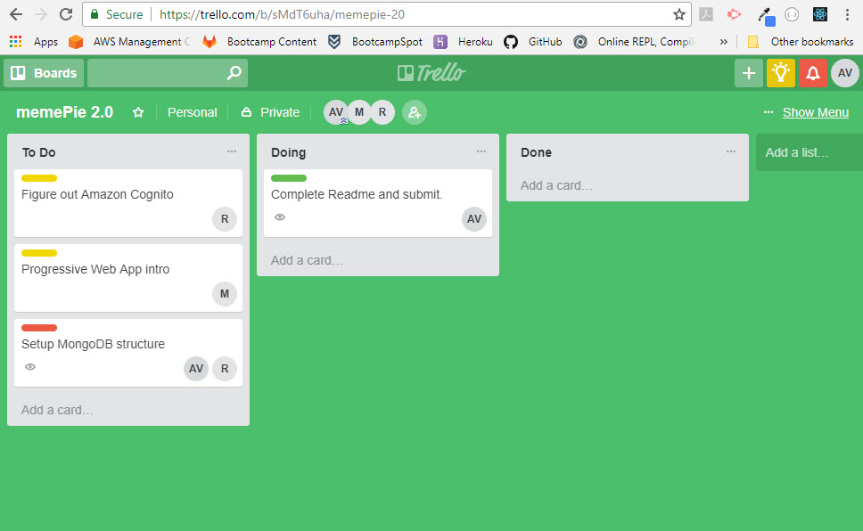
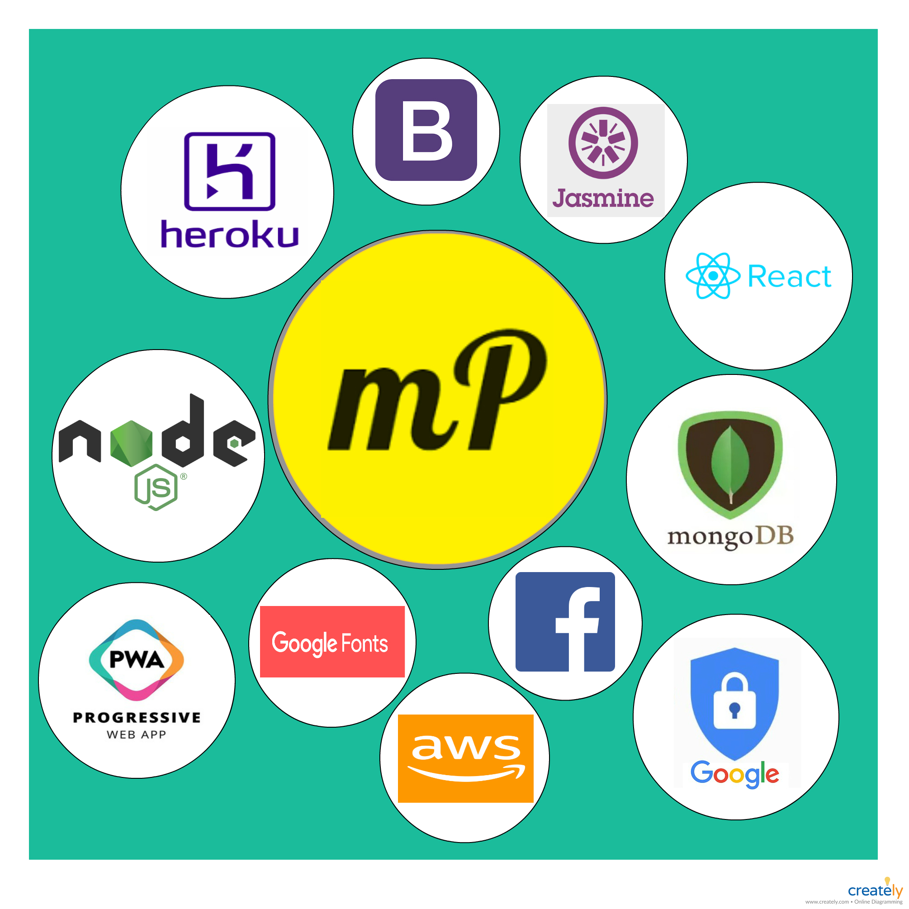

# memePie 2.0
### memeHub on steroids.

Hello, and welcome. 

This newly renovated and much anticipated twist to our first project will bring together all the new technologies we've come to learn and love. memePie 2.0 has some of the original functionalities, look, and feel, but by implementing libraries, technologies, and packages such as MongoDB, React.js, and Amazon Cognito we are now able to provide user authentication, faster loading times, the ability to search, and a true mobile application experience.

## Team Members and role distribution:

#### Michael Garland: 
- To start, Garland is in charge of all things PWA (Progressive Web App) and getting a concrete foundation for the database. He'll continue with the fantastic front-end design and flow from the original app.

#### Matthew McCloskey:
- Mr. McCloskey is putting in another round of 10 hr days giving Amazon Cognito a second go, and also working on DB structure. Matthew seems to know his GET/POST routes so he will be overseeing them at this time.

#### Andrea Velasquez:
- Andrea is establishing a flow for project milestones and completion dates. She will be giving React.js a solid try and doing unit testing using Jasmine framework. Deployment to different platforms such as Heroku and GitHub as needed.

# Technologies and build:

## New technologies:

- AWS for cloud storage.
- Amazon Cognito for user authentication.
- Jasmine framework for unit testing.
- Progressive Web App functionality.

